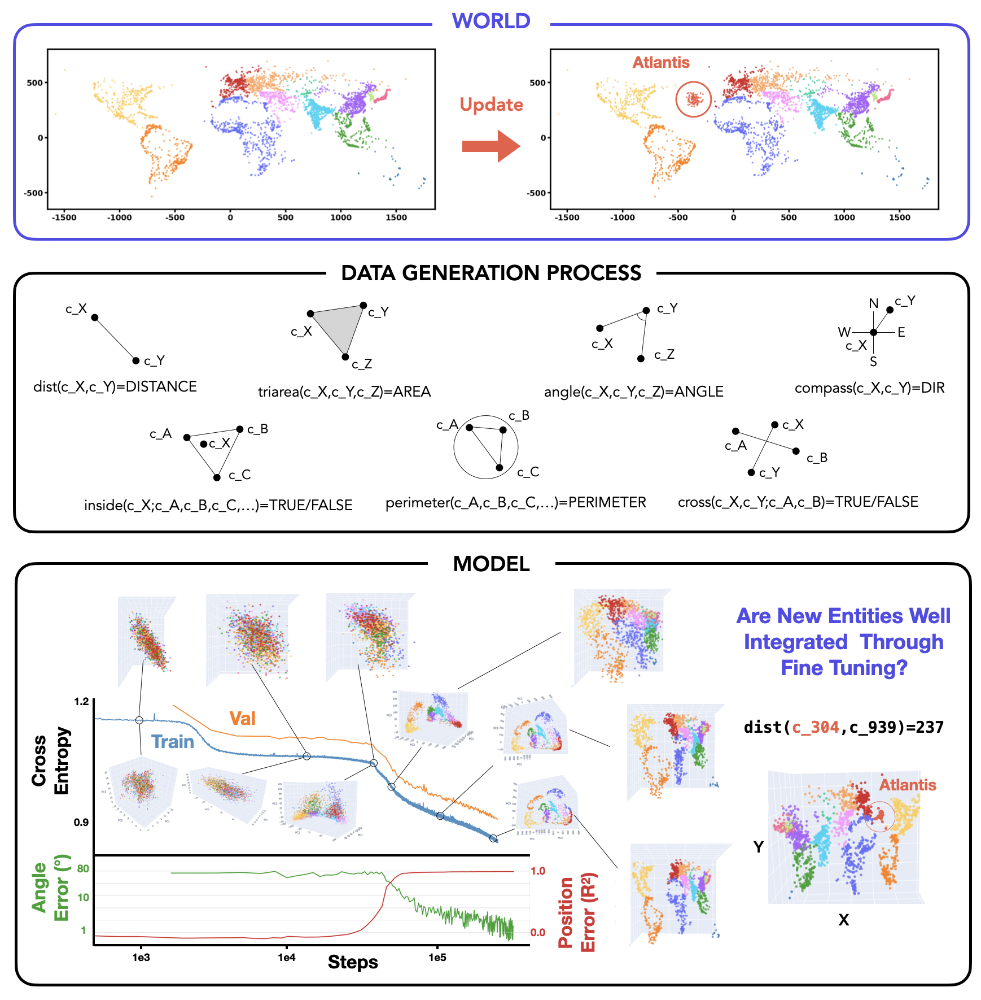

# Convergent World Representations and Divergent Tasks

**Paper:** [Preprint (forthcoming on arXiv)](paper/) | **Research Process:** [cfpark00.github.io/world-rep-research-flow](https://cfpark00.github.io/world-rep-research-flow/) | **3D Visualizations:** [Open Science Framework](https://osf.io/jb8an/?view_only=da001f31c0534dc0b6476141f30db90d)

**Contact:** [Core Francisco Park](https://corefranciscopark.com)

## Abstract

While neural representations are central to modern deep learning, the conditions governing their geometry and their roles in downstream adaptability remain poorly understood. We develop a framework clearly separating the underlying world, the data generation process and the resulting model representations to study these questions in a controlled setup. 5,075 city coordinates define the world and 7 geometric tasks generate the training data for autoregressive training. We find that different tasks give rise to qualitatively and quantitatively distinct world representation geometries. However, multi-task training drives convergence of world representations: models trained on non-overlapping tasks develop aligned geometric representations, providing controlled evidence for the Multitask Scaling Hypothesis of the Platonic Representation Hypothesis. To study adaptation, we pretrain models on all tasks, then test whether new entities (cities) can be consistently integrated into the representation space via fine-tuning. Surprisingly, we find that despite multi-task pretraining, some tasks, which we call *divergent*, actively harm the representational integration of new entities and harm generalization. Our results show that training on multiple relational tasks reliably produces convergent world representations, but lurking divergent tasks can catastrophically harm new entity integration via fine-tuning.



## Key Findings

1. **Task-Dependent Geometry and Multi-Task Convergence.** Different geometric tasks operating on the same world produce qualitatively distinct representational geometries (thread-like, 2D manifolds, fragmented clusters). Despite this, multi-task training drives convergence: models trained on completely disjoint task sets develop highly aligned representations (CKA saturating around 0.85 for 2-3 tasks), providing controlled evidence for the Multitask Scaling Hypothesis of the Platonic Representation Hypothesis.

2. **Divergent Tasks Harm Fine-Tuning Generalization.** When fine-tuning a multi-task pretrained model to integrate new entities (100 synthetic "Atlantis" cities), certain tasks, specifically the distance task, actively degrade cross-task generalization rather than simply failing to contribute. Single-task representational similarity (CKA) partially predicts this fine-tuning behavior, even though those CKA values come from models trained from scratch independently.

3. **Divergent Tasks Disrupt Representational Integration.** Linear probe analysis reveals that divergent tasks cause new entities to be encoded in hidden subspaces rather than integrated into the shared world manifold. Reconstruction error for Atlantis cities is nearly an order of magnitude worse when fine-tuned with divergent task data, yet the same cities integrate seamlessly when included during pretraining, confirming the failure stems from optimization dynamics rather than geometric difficulty.

## Project Structure

```
.
├── src/                        # All Python source code
│   ├── data_generation_v1/     # Data generation (7 tasks, city datasets, tokenizer)
│   ├── training/               # Model training (train.py)
│   ├── eval/                   # Checkpoint evaluation
│   ├── analysis/               # CKA, PCA, representation analysis
│   ├── visualization/          # City and result visualization
│   ├── scripts/                # Orchestration scripts (entry points)
│   ├── metrics.py              # Centralized task metric calculations
│   ├── evaluation.py           # Unified evaluation module
│   └── utils.py                # Shared utilities
├── configs/                    # YAML configuration files
│   ├── data_generation_v1/     # Dataset and tokenizer configs
│   ├── training/               # Model training configs
│   ├── revision/               # Revision experiment configs (exp1-exp6)
│   └── ...                     # Analysis, evaluation, etc.
├── scripts/                    # Bash execution scripts
│   ├── data_generation_v1/     # Data generation scripts
│   ├── training/               # Training scripts
│   ├── revision/               # Revision experiment scripts
│   └── ...                     # Analysis, evaluation, etc.
├── data/                       # Experiment outputs (gitignored)
├── paper/                      # ICLR-formatted preprint (Overleaf-synced)
├── docs/                       # Documentation and development logs
├── scratch/                    # Temporary workspace (gitignored)
└── rebuttal/                   # ICLR 2026 rebuttal materials
```

## Setup and Installation

This project uses [uv](https://github.com/astral-sh/uv) for Python package management.

```bash
# Clone the repository
git clone https://github.com/cfpark00/world-map-representation.git
cd world-map-representation

# Install dependencies
uv sync

# Configure environment
cp .env.example .env
# Edit .env as needed
```

Key dependencies include PyTorch, Transformers (HuggingFace), scikit-learn, plotly, and standard scientific Python libraries. See `pyproject.toml` for the full list.

## Running Experiments

All experiments follow a three-part pattern: **configs** define parameters, **scripts** execute them, **data/** stores outputs.

```bash
# Generate datasets
bash scripts/data_generation_v1/cities/create_city_dataset.sh

# Train a model
bash scripts/training/train_base.sh

# Or run directly with a config
uv run python src/training/train.py configs/training/train_dist_1M_no_atlantis_5epochs.yaml
```

Every config file specifies an `output_dir` field that determines where results are written. Outputs typically include `figures/`, `results/`, and `logs/` subdirectories.

The project includes extensive revision experiments (exp1 through exp6) covering seed robustness, model width ablations, scattered Atlantis controls, and cross-seed CKA analyses. These are organized under `configs/revision/` and `scripts/revision/`.

## Citation

```bibtex
@article{park2025convergent,
  title={Convergent World Representations and Divergent Tasks},
  author={Park, Core Francisco},
  year={2025},
  note={Preprint}
}
```

## License

MIT License. See LICENSE file for details.
